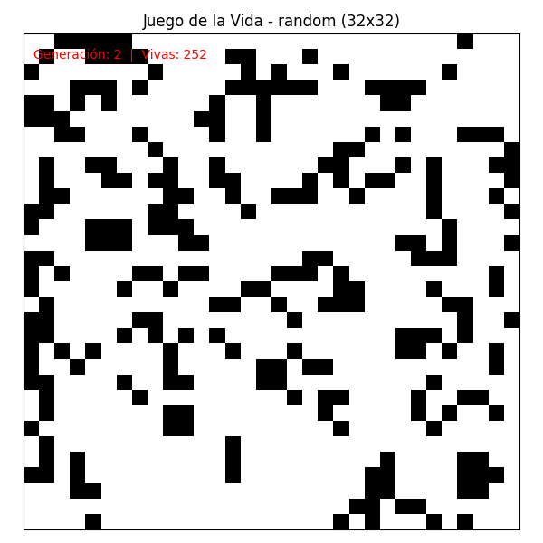
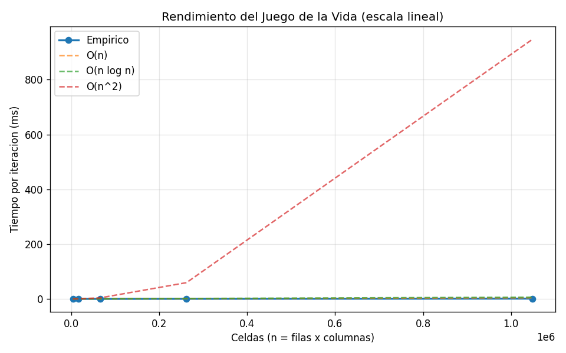
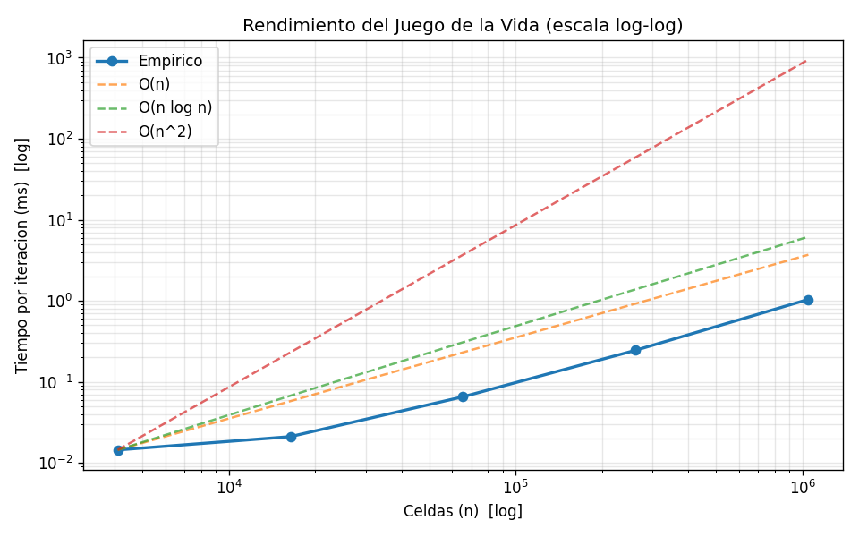
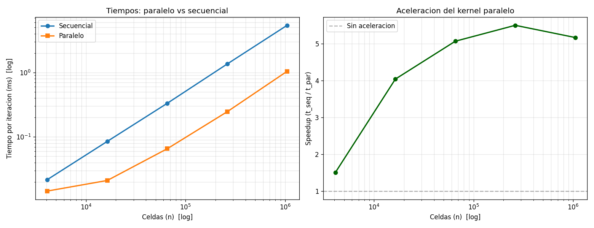

# Juego de la Vida de Conway

Proyecto desarrollado para la **Tarea 1** del curso de Programacion
Paralela y Distribuida (LEAD University). Implementa el automata
celular clasico de Conway sobre una rejilla toroidal, con un kernel
acelerado mediante Numba y herramientas de visualizacion y medicion
de rendimiento.

---

## Contenido

- [Instalacion](#instalacion)
- [Ejecucion](#ejecucion)
- [Resultados obtenidos](#resultados-obtenidos)
- [Analisis y conclusiones](#analisis-y-conclusiones)

---

## Instalacion

Antes de ejecutar el proyecto se debe contar con Python 3.9 o
superior. Las dependencias estan listadas en `requirements.txt` y se
instalan con:

```bash
python -m pip install -r requirements.txt
```

> Si aparece un error tipo `ModuleNotFoundError` aunque las librerias
> esten instaladas, suele deberse a que `pip` y `python` apuntan a
> instalaciones distintas. Usar `python -m pip install ...` evita ese
> problema.

## Ejecucion

El punto de entrada es `main.py`, que ofrece dos subcomandos:

**1) Ver una animacion con un patron clasico**

```bash
python main.py demo --pattern *patron* --size *tamano* --steps *generaciones*
```

Donde `*patron*` puede ser cualquiera de:
`block`, `beehive`, `blinker`, `toad`, `beacon`, `pulsar`, `glider`,
`lwss` o `random` (estado aleatorio).

**2) Guardar la animacion en disco (sin abrir ventana)**

```bash
python main.py demo --pattern pulsar --size 32 --steps 60 --save salida.gif --no-show
```

**3) Medir el rendimiento del simulador**

```bash
python main.py benchmark --sizes 32 64 128 256 512 1024 --reps 50
```

Para comparar adicionalmente la version paralela contra la secuencial:

```bash
python main.py benchmark --sizes 64 128 256 512 1024 --reps 50 --compare
```

Las graficas y los GIFs se almacenan automaticamente en `resultados/`.

---

## Resultados obtenidos

### Patrones simulados

A continuacion se muestran tres animaciones representativas del
comportamiento del simulador:

<p align="center">
  
  <br><em>Estado inicial aleatorio sobre una grilla de 32x32.</em>
</p>

### Rendimiento del kernel

El comportamiento del tiempo de ejecucion frente al tamano del tablero
se representa en escala lineal:

<p align="center">
  
</p>

La grafica log-log permite identificar el exponente real de
complejidad como la pendiente de la recta empirica:

<p align="center">
  
</p>

Por ultimo, la comparacion entre los kernels paralelo y secuencial
muestra tanto los tiempos absolutos como el factor de aceleracion
(speedup) obtenido al usar `prange` de Numba:

<p align="center">
  
</p>

### Datos numericos

Mediciones representativas (los valores exactos dependen del
hardware donde se ejecute el benchmark):

| Tamano       | n (celdas)  | t_seq (ms) | t_par (ms) | Speedup |
|:------------:|:-----------:|:----------:|:----------:|:-------:|
| 32 x 32      | 1 024       | 0.0078     | 0.0067     | 1.16x   |
| 64 x 64      | 4 096       | 0.0297     | 0.0225     | 1.32x   |
| 128 x 128    | 16 384      | 0.1296     | 0.0793     | 1.63x   |
| 256 x 256    | 65 536      | 0.4635     | 0.2732     | 1.70x   |
| 512 x 512    | 262 144     | 1.6693     | 1.0158     | 1.64x   |
| 1024 x 1024  | 1 048 576   | 6.9413     | 3.7791     | 1.84x   |

Pendiente ajustada en log-log: **≈ 0.9**, consistente con O(n).

---

## Analisis y conclusiones

### Sobre la complejidad

El analisis teorico predice que cada generacion del Juego de la Vida
requiere un trabajo proporcional al numero total de celdas: cada celda
es visitada exactamente una vez y se realiza una cantidad constante de
operaciones (sumar 8 vecinos y aplicar las reglas). La complejidad
esperada es por lo tanto **O(n)**.

Los resultados experimentales confirman esta prediccion. La pendiente
empirica en escala log-log es aproximadamente **0.9**, muy cercana al
valor teorico de 1.0. La pequena desviacion se explica porque, en
tableros pequenos (32x32 o 64x64), el costo fijo de invocar el kernel
de Numba es comparable al trabajo real, lo cual "achata" la pendiente
en la zona de tamanos pequenos.

### Sobre la memoria

El consumo de memoria escala estrictamente de forma **lineal** con el
numero de celdas: se reservan dos buffers (`np.uint8`) para implementar
el patron de doble buffering, por lo que el costo total es
`2 * filas * columnas` bytes. Esto se traduce en:

- 32 KB para una grilla de 128x128.
- 2 MB para 1024x1024.
- 32 MB para 4096x4096.

Hasta tamanos del orden de varios miles de celdas por lado el
simulador funciona sin problemas en una computadora de escritorio.

### Cuellos de botella detectados

1. **Compilacion JIT inicial.** La primera invocacion del kernel
   demora 1-2 segundos mientras Numba lo compila. Para evitar
   contaminar las mediciones, el benchmark realiza un periodo de
   warmup antes de cronometrar.
2. **Algoritmo memory-bound.** Cada celda procesada requiere leer 9
   celdas (la propia y las 8 vecinas). Esto significa que el cuello de
   botella no es la CPU sino el ancho de banda de memoria; aumentar el
   numero de hilos no acelera linealmente porque todos compiten por el
   mismo recurso.
3. **Overhead de cruce Python -> Numba.** En tableros muy pequenos el
   costo de invocar el kernel es comparable al trabajo real, lo que
   limita el rendimiento percibido para esos casos.

### Sobre el paralelismo

El factor de aceleracion crece con el tamano de la grilla, pasando de
~1.16x en 32x32 hasta **~1.84x en 1024x1024**, y luego se estabiliza.
Este patron es consistente con la **ley de Amdahl** y con el caracter
memory-bound del problema: a partir de cierto tamano el ancho de banda
de memoria pone un techo al speedup, sin importar cuantos hilos se
agreguen.

### Conclusiones generales

- La implementacion alcanza una complejidad **lineal tanto en tiempo
  como en memoria**, en linea con la prediccion teorica.
- El kernel paralelo de Numba aporta una aceleracion real cercana a
  **2x**, suficiente para grillas medianas pero limitada por el ancho
  de banda de memoria.
- Para escalar significativamente a tableros muy grandes (8192x8192 y
  mas) seria necesario cambiar de estrategia: bit-packing para reducir
  el trafico de memoria, ejecucion en GPU (Numba.cuda) o
  particionamiento distribuido con MPI.
- El ejercicio ilustra una leccion central de la programacion paralela:
  **no todo programa escala linealmente con el numero de hilos**;
  reconocer si un algoritmo es compute-bound o memory-bound es
  fundamental para elegir la tecnica de paralelizacion adecuada.
